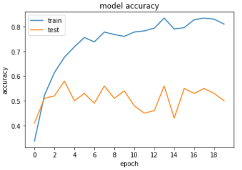

The purpose of this seminar work is to classify the music genre of song snippets by training a convolutional neural network (CNN) with time-frequency spectrograms of the respective song. The field of genre classification has only recently emerged into the benefits of fully automated classification algorithms with the help of state-of-the-art neural networks. A transfer-learning approach using the well-known and open source VGG16 deep learning model peaked in a validation accuracy of 59 %. This was achieved on a dataset of 1000 song snippets equally distributed into 10 genres. 

<ins>General approach:</ins>
1. Select dataset (GTZAN containing 1000 song snippets of 30 seconds each, representing 10 genres)
2. Data preprocessing (Creating MEL-spectrograms using a short time Fourier Transformation STFT)
3. Load and fine-tune VGG16 model (added five layers: Flatten -> Dropout -> Dense -> Dropout -> Output Layer Softmax)
4. Train and Test model

**Final results of the trained VGG16 transfer-learning prediction model:**

Main sources:
1. https://github.com/priya-dwivedi/Music_Genre_Classification
2. https://github.com/HareeshBahuleyan/music-genre-classification
